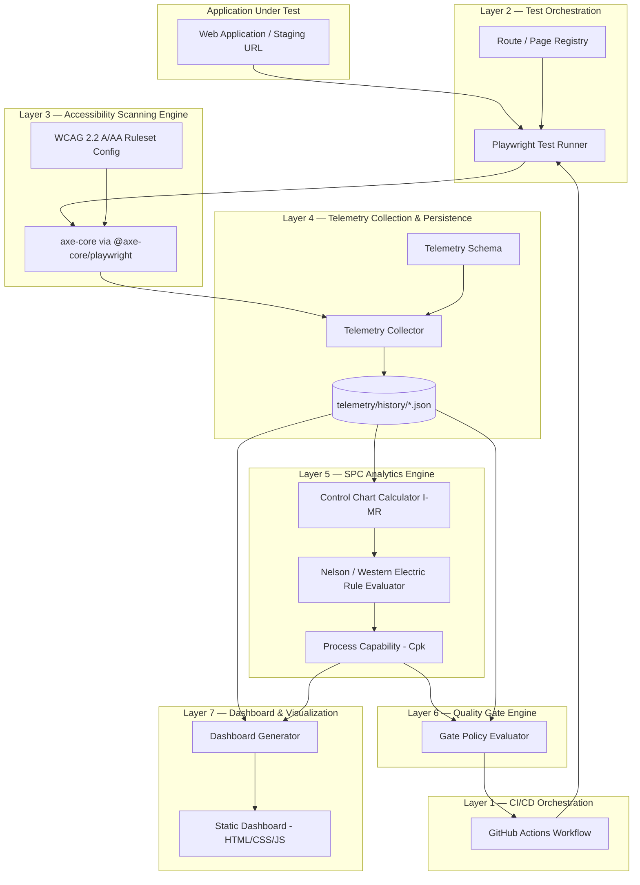
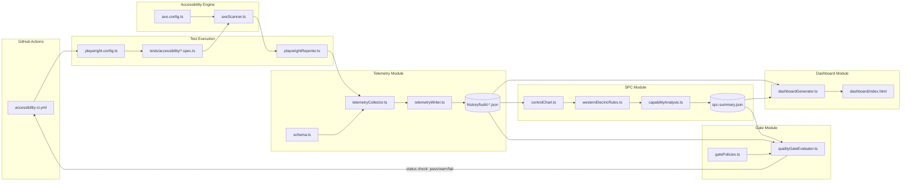
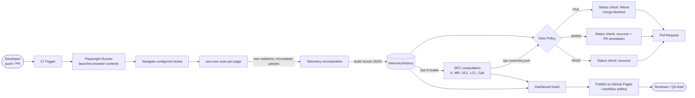
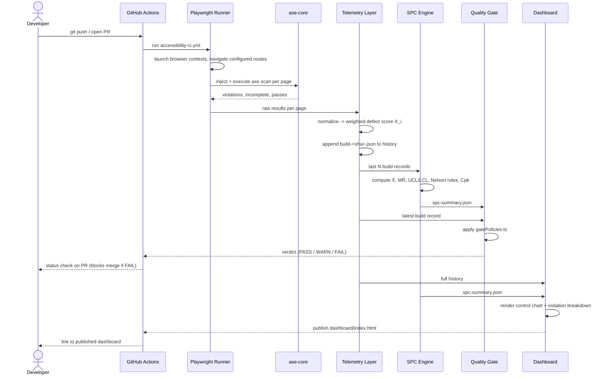

# Automated Accessibility Telemetry Framework
## System Architecture Document

**Project**: Automated Accessibility Telemetry Framework using Playwright, axe-core, Statistical Process Control (SPC), and CI/CD Quality Gates
**Programme**: BITS Pilani — M.Tech Software Engineering, Final Year Dissertation
**Document type**: System Architecture & Design Specification
**Status**: Draft v1.0

---

## 1. Executive Summary & Goals

Automated accessibility testing tools (axe-core, Lighthouse, pa11y) answer a narrow question: *does this build violate a WCAG rule, yes or no?* They do not answer the question a quality engineer actually cares about across a product's lifetime: *is our accessibility quality stable, improving, or quietly degrading?*

This framework treats accessibility defect counts as a **manufacturing-style process variable**. Every CI build produces one measurement. Statistical Process Control (SPC) — the discipline used to monitor variation in manufactured parts — is applied to that measurement stream to distinguish ordinary fluctuation ("common cause") from a genuine regression ("special cause"), and a CI/CD quality gate acts on that distinction automatically.

**Goals**

1. Automate WCAG 2.2 accessibility testing across the application under test.
2. Collect historical quality telemetry across builds, not just point-in-time pass/fail results.
3. Apply Statistical Process Control (SPC) to monitor accessibility quality variation over time.
4. Implement automated, statistically-informed Quality Gates in CI/CD.
5. Generate an engineering dashboard for accessibility quality governance and audit.

**Confirmed technology stack** (from the project's `package.json`): Playwright, `@axe-core/playwright`, TypeScript, Node.js, JSON telemetry persistence, a static HTML/CSS/JS dashboard, GitHub Actions.

---

## 2. System Architecture

The system is organized as eight layers. Each layer has one job and hands a well-defined artifact to the next layer — this is what makes the SPC and gating stages testable independently of the browser automation stages.



**Layer responsibilities at a glance**

| Layer | Name | Responsibility |
|---|---|---|
| L1 | CI/CD Orchestration | Triggers the pipeline, provisions the runner, enforces the gate result as a required status check |
| L2 | Test Orchestration | Launches browsers, navigates the configured route set, hosts the axe injection point |
| L3 | Accessibility Scanning Engine | Runs axe-core against each rendered page, scoped to WCAG 2.2 A/AA |
| L4 | Telemetry Collection & Persistence | Normalizes raw axe results into a versioned per-build JSON record, appends to history |
| L5 | SPC Analytics Engine | Computes control limits, evaluates out-of-control signals, computes process capability |
| L6 | Quality Gate Engine | Applies a declarative policy against the latest point + SPC signals, returns PASS/WARN/FAIL |
| L7 | Dashboard & Visualization | Renders the historical control chart and violation breakdown as a static site |

---

## 3. Component Diagram



Every arrow in this diagram is a file boundary, not a function call — each module reads and writes JSON on disk. This is a deliberate architectural choice (see §7, Technology Justification): it keeps every stage independently testable and gives the framework a full audit trail for free.

---

## 4. Data Flow Diagram



**Data at rest** (the two persisted artifacts every other stage depends on):

- `telemetry/history/build-<sha>.json` — one immutable record per build (append-only; never mutated after write).
- `telemetry/aggregated/spc-summary.json` — recomputed each run from the rolling window; disposable/regenerable.

---

## 5. Folder Structure

```
accessibility-telemetry-framework/
├── .github/
│   └── workflows/
│       └── accessibility-ci.yml        # CI trigger, gate enforcement, dashboard publish
├── docs/
│   └── architecture/
│       └── ARCHITECTURE.md             # this document
├── src/
│   ├── config/
│   │   ├── axe.config.ts               # WCAG tags, rule allow/deny list
│   │   ├── sites.config.ts             # routes to scan, base URL per environment
│   │   └── spc.config.ts               # window size, sigma multiplier, USL policy
│   ├── scanners/
│   │   └── axeScanner.ts               # wraps @axe-core/playwright, returns raw results
│   ├── telemetry/
│   │   ├── schema.ts                   # TypeScript types for a telemetry record
│   │   ├── telemetryCollector.ts       # raw axe results -> normalized record
│   │   └── telemetryWriter.ts          # append-only writer + history index
│   ├── spc/
│   │   ├── controlChart.ts             # I-MR chart: center line, UCL/LCL
│   │   ├── westernElectricRules.ts     # Nelson rule 1-4 evaluation
│   │   └── capabilityAnalysis.ts       # Cpk against USL
│   ├── gates/
│   │   ├── gatePolicies.ts             # declarative pass/warn/fail policy
│   │   └── qualityGateEvaluator.ts     # applies policy, returns gate verdict
│   ├── reporters/
│   │   └── playwrightReporter.ts       # custom Playwright reporter -> telemetry collector
│   └── dashboard/
│       ├── dashboardGenerator.ts       # renders static site from telemetry + spc-summary
│       └── templates/
├── dashboard/                          # generated output (git-ignored except .gitkeep)
│   ├── index.html
│   └── assets/
│       ├── controlChart.js
│       ├── trendChart.js
│       └── styles.css
├── telemetry/
│   ├── history/                        # build-<sha>.json, append-only
│   └── aggregated/
│       └── spc-summary.json            # regenerated every run
├── tests/
│   └── accessibility/
│       └── *.spec.ts                   # Playwright specs invoking the axe scanner
├── playwright.config.ts
├── tsconfig.json
├── package.json
└── package-lock.json
```

---

## 6. Module Responsibilities

| Module | File(s) | Responsibility | Depends on |
|---|---|---|---|
| Route Registry | `sites.config.ts` | Declares which URLs/components are in scope for scanning | — |
| Test Orchestrator | `tests/accessibility/*.spec.ts`, `playwright.config.ts` | Drives browser navigation, invokes the scanner per route | Route Registry |
| Accessibility Scanner | `axeScanner.ts`, `axe.config.ts` | Injects axe-core, executes against WCAG 2.2 A/AA tag set, returns raw results | Test Orchestrator |
| Telemetry Schema | `schema.ts` | Single source of truth for the shape of a build record (versioned) | — |
| Telemetry Collector | `telemetryCollector.ts` | Normalizes raw axe output into a schema-conformant record; computes weighted defect score | Scanner, Schema |
| Telemetry Writer | `telemetryWriter.ts` | Persists the record as an immutable file; maintains a lightweight index for fast reads | Collector |
| Control Chart Calculator | `controlChart.ts` | Computes X̄, MR̄, σ̂, UCL/LCL for the rolling window | Telemetry history |
| Rule Evaluator | `westernElectricRules.ts` | Flags out-of-control and trend signals against the chart | Control Chart Calculator |
| Capability Analyzer | `capabilityAnalysis.ts` | Computes one-sided Cpk against the policy's upper spec limit | Control Chart Calculator |
| Gate Policy | `gatePolicies.ts` | Declares the pass/warn/fail thresholds as data, not code | — |
| Gate Evaluator | `qualityGateEvaluator.ts` | Applies policy to the latest point + SPC signals; returns a verdict object | SPC Engine, Gate Policy |
| Dashboard Generator | `dashboardGenerator.ts` | Renders history + SPC summary into a static, dependency-free site | Telemetry history, SPC summary |
| CI Workflow | `accessibility-ci.yml` | Sequences all of the above; publishes the gate verdict as a required status check | All modules |

---

## 7. Technology Justification

| Technology | Role | Why chosen | Alternative considered |
|---|---|---|---|
| **Playwright** | Browser automation / test orchestration | Auto-waiting eliminates flaky accessibility scans on dynamic/SPA content; first-class TypeScript API; one API across Chromium/Firefox/WebKit lets the same telemetry pipeline report cross-browser accessibility drift | Selenium (no auto-wait, heavier flake burden), Puppeteer (Chromium-only) |
| **@axe-core/playwright** | Accessibility rule engine | Deque's axe-core is the de facto industry-standard, actively maintained WCAG rule engine with configurable rule tags (`wcag2a`, `wcag22aa`, …); official Playwright binding avoids hand-rolled injection | pa11y (thinner rule coverage), manual Lighthouse CLI invocation (accessibility is a secondary concern of Lighthouse, harder to isolate) |
| **TypeScript** | Implementation language | A statically-typed `TelemetryRecord` schema catches drift between what the scanner produces and what the SPC engine consumes — critical because the telemetry format must stay stable across dozens of historical builds | Plain JavaScript (schema drift across a growing history file is a real risk without types) |
| **Node.js** | Runtime | Single runtime for test execution, SPC computation, and dashboard generation — no polyglot toolchain, no extra CI setup steps | Python for the SPC stage (would split the toolchain and CI environment in two for no analytical benefit — the SPC math involved is arithmetic, not scientific-computing-scale) |
| **JSON telemetry persistence** | Historical data store | Human-readable, diffable in pull requests, requires no database provisioning for an academic-scope project, and doubles as an audit trail directly in version control | SQLite/Postgres (real durability benefits, but adds infrastructure the dissertation's scope doesn't need — see §8 threats to validity in future work) |
| **Static HTML/CSS/JS dashboard** | Visualization | Zero build step, deployable to GitHub Pages as a workflow artifact, no framework dependency to keep current across the project's lifetime | React/Vue dashboard (heavier for a report-style, mostly-read-only surface) |
| **GitHub Actions** | CI/CD orchestration | Native PR status checks make the quality gate enforceable at the branch-protection level; free for the project's repo tier; YAML pipeline is itself part of the reproducible artifact for the dissertation | Jenkins/GitLab CI (viable, but adds infrastructure to host and maintain) |

---

## 8. Quality Management Concepts

This is the section that gives the framework its research substance: SPC is not decorative here, it is the mechanism the quality gate reasons over.

### 8.1 Common cause vs. special cause variation

Every build's accessibility defect count varies somewhat even when nothing has regressed (a new page added to the crawl set, a third-party widget's markup shifting slightly). SPC's foundational distinction is between:

- **Common cause variation** — natural, expected noise in the process. The process is "in control."
- **Special cause variation** — a signal that something structurally changed (a regression was introduced, a component lost its ARIA labelling). The process is "out of control" and warrants investigation.

A static threshold gate ("fail if > 10 violations") cannot make this distinction — it cannot tell a one-off blip from a sustained regression. An SPC-based gate can.

### 8.2 Chart selection: Individuals–Moving Range (I-MR)

Builds arrive one at a time, not in natural subgroups of several samples per time point — the same situation SPC addresses with an **I-MR chart** rather than an X̄-R chart. The framework computes a single **weighted defect score** per build as the individual measurement:

```
X_i = 10·(critical) + 5·(serious) + 2·(moderate) + 1·(minor)
```

This mirrors the classic severity-weighted defect density formula used in software quality engineering, so that one critical WCAG failure is not statistically invisible next to ten minor ones.

**Control limit formulas** (window of the last *N* builds, N configurable — default 25):

```
MR_i        = |X_i − X_(i-1)|
Center Line  X̄  = mean(X_1 … X_n)
Center Line  MR̄ = mean(MR_2 … MR_n)
UCL_X   = X̄ + 2.66 × MR̄
LCL_X   = max(0, X̄ − 2.66 × MR̄)
UCL_MR  = 3.267 × MR̄
σ̂       = MR̄ / 1.128            (d2 constant for n = 2)
```

**Known special-cause exclusion.** X̄, MR̄, σ̂, and every control limit above are computed only from builds that have not been explicitly classified as a special cause (`src/spc/specialCauseClassifications.ts`, keyed by commit SHA). Known, already-investigated special-cause observations — e.g. a deliberately seeded worst-case build used to validate the scoring/detection pipeline itself — are retained for historical traceability and remain visible on the dashboard, but are excluded from the calculation of normal-process SPC control limits, so a known anomaly cannot distort the limits meant to catch the next one. This is a declarative, explicit classification only: nothing in the engine infers "special cause" from a value's size, so an unclassified record, however extreme, remains fully eligible for control-limit calculation.

### 8.3 Western Electric / Nelson rules

A point inside the control limits can still be a signal if the *pattern* is non-random. The Rule Evaluator implements four Nelson rules:

| Rule | Trigger | Interpretation |
|---|---|---|
| 1 | One point beyond 3σ (outside UCL/LCL) | Sudden, large regression |
| 2 | 2 of 3 consecutive points beyond 2σ, same side | Emerging shift |
| 3 | 4 of 5 consecutive points beyond 1σ, same side | Early drift |
| 4 | 8 consecutive points on the same side of X̄ | Sustained process shift (e.g., a slow accessibility debt creep) |

Rule 4 is the one static gates are structurally blind to: eight builds in a row that are each individually "fine" but all trending the same direction.

### 8.4 Process capability (Cpk)

Given an organizationally agreed **upper specification limit (USL)** — e.g., "no more than 15 weighted defect points is tolerable" — the framework computes a one-sided capability index:

```
Cpu = (USL − X̄) / (3σ̂)
```

`Cpu ≥ 1.33` is conventionally "capable," `< 1.0` means the process cannot reliably meet the specification even without any special-cause event — a signal that the *policy or the codebase's baseline*, not just an individual build, needs attention.

### 8.5 Quality gates as poka-yoke

A gate that mechanically blocks a merge on an out-of-control signal is a software instance of **poka-yoke** (mistake-proofing): it removes the option to accidentally ship a statistically-confirmed regression, rather than relying on a reviewer to notice a dashboard.

### 8.6 PDCA mapping

| PDCA phase | Framework equivalent |
|---|---|
| Plan | Route registry + axe rule configuration define what "quality" is measured |
| Do | CI executes the scan and produces a build record |
| Check | SPC engine evaluates the record against control limits and capability |
| Act | Gate blocks/warns; dashboard feeds the next planning cycle |

---

## 9. Research Contribution

**Research gap.** Existing accessibility CI tooling (axe CLI/axe-core CI integrations, `pa11y-ci`, Lighthouse CI accessibility budgets) implements **static threshold gating**: a build fails if a fixed count is exceeded, full stop. None of the widely used tools model the defect series as a statistical process or distinguish transient noise from sustained regression. Conversely, SPC is well established in manufacturing and in general software-defect tracking, but its application to **automated, per-build accessibility telemetry** specifically is not a solved or common practice.

**Positioning.** This framework sits at the intersection of two established fields — accessibility engineering (WCAG conformance automation) and software quality engineering (SPC, control charts, process capability) — and its contribution is the bridge between them, not a novel algorithm in either field alone.

**Research questions**

- **RQ1** — Can I-MR control charts, using a severity-weighted defect score, meaningfully model the variation of automated accessibility violation counts across CI builds?
- **RQ2** — Does an SPC-informed quality gate reduce false-positive gate failures (blocking on ordinary noise) and false-negative gate passes (missing a slow, sustained regression) relative to a static-threshold gate, on the same build history?
- **RQ3** — Which distributional assumptions (the I-MR chart's near-normality assumption vs. the Poisson-like nature of raw defect counts) hold in practice for accessibility telemetry, and does the weighted-score transform in §8.2 make the near-normality assumption more defensible?

**Contributions**

1. **C1 — Framework**: an open, reusable reference architecture (this document + implementation) integrating Playwright, axe-core, SPC, and CI/CD gating.
2. **C2 — Method**: a defined procedure for converting raw axe-core output into an SPC-suitable individual measurement (the weighted defect score), including chart selection rationale.
3. **C3 — Policy model**: a declarative, statistically-grounded quality gate policy (§8.5) as an alternative to static-threshold gating, directly comparable to existing tools' behavior on the same data.
4. **C4 — Empirical dataset**: the telemetry history produced by running the framework against one or more real applications over time, usable as evidence for RQ1–RQ3 in the dissertation's evaluation chapter.

**Threats to validity to address in the dissertation**: JSON-file persistence does not scale past a few thousand builds (acceptable at dissertation scope; noted as future work toward a real time-series store); I-MR charts assume approximate normality of the defect score, which should be checked empirically against the collected dataset rather than assumed (this is itself RQ3).

---

## 10. End-to-End Workflow



**Narrative walkthrough**

1. A developer pushes a commit or opens a pull request.
2. GitHub Actions triggers `accessibility-ci.yml`.
3. Playwright launches the configured browser(s) and navigates every route in `sites.config.ts`.
4. `@axe-core/playwright` runs against each rendered page, scoped to the WCAG 2.2 A/AA rule tags.
5. The Telemetry Collector normalizes raw results into a schema-conformant record and computes the weighted defect score `X_i`.
6. The Telemetry Writer appends the record to `telemetry/history/` — this file is never rewritten, only added to.
7. The SPC Engine reads the last *N* records, computes the I-MR control limits, evaluates the four Nelson rules, and computes Cpk against the configured USL.
8. The Quality Gate Evaluator applies the declarative policy in `gatePolicies.ts` against the latest point and the SPC signals, producing PASS, WARN, or FAIL.
9. GitHub Actions reports that verdict as a commit status / check run; if branch protection requires it, a FAIL blocks the merge.
10. The Dashboard Generator renders the full history and SPC summary into a static site and publishes it (GitHub Pages or workflow artifact) for reviewers and, ultimately, for the dissertation's evaluation evidence.

---

## Appendix A — Telemetry Record Schema (per build)

```json
{
  "buildId": "gha-run-4821",
  "commitSha": "9f2a1c3",
  "branch": "feature/checkout-redesign",
  "triggeredBy": "pull_request",
  "timestamp": "2026-08-02T09:14:00Z",
  "wcagLevel": "AA",
  "pagesScanned": 12,
  "violationsBySeverity": { "critical": 0, "serious": 2, "moderate": 5, "minor": 3 },
  "violationsByRule": [
    {
      "ruleId": "color-contrast",
      "impact": "serious",
      "wcagCriteria": ["1.4.3"],
      "occurrences": 4,
      "pages": ["/checkout", "/cart"]
    }
  ],
  "defectScore": 24,
  "totalNodesFailed": 14
}
```

## Appendix B — SPC Summary Schema

```json
{
  "windowSize": 25,
  "centerLine": 18.4,
  "mrBar": 6.1,
  "sigma": 5.41,
  "uclX": 34.6,
  "lclX": 2.2,
  "uclMR": 19.9,
  "usl": 40,
  "cpu": 1.33,
  "latestSignal": "IN_CONTROL",
  "points": [
    { "buildId": "gha-run-4821", "x": 24, "mr": 3, "nelsonFlags": [] }
  ]
}
```

## Appendix C — Glossary

| Term | Meaning |
|---|---|
| WCAG 2.2 | Web Content Accessibility Guidelines, version 2.2 (W3C) |
| I-MR chart | Individuals and Moving Range control chart |
| UCL / LCL | Upper / Lower Control Limit |
| Cpk / Cpu | Process capability index (one-sided, upper) |
| Nelson rules | Pattern-based out-of-control detection rules (subset of the Western Electric rules) |
| Poka-yoke | Mistake-proofing — a mechanism that prevents a defect from passing forward |
